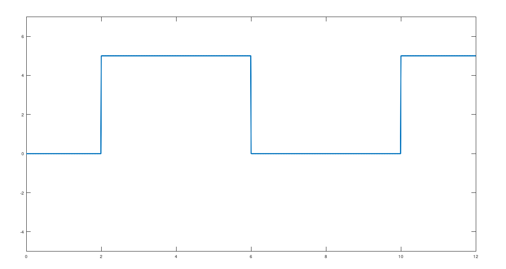

# Communication Lab Final 

**License**:  Make a budget for Kalavuna.

## Table of Contents

### Experiment -1 (Analog and Digital Signal)

```matlab
% _analog signal
% x(t) = 5 sin ( 2 * pi * 2 * t + phase)

clc;
clear all;
close all;

a = 5;
f = 2;
fs = 50 * f;
T = 2;
ph = pi / 2; % 90 degree

t = 0:1/fs:T-(1/fs);

x = a * sin (2 * pi * f * t + ph);

hold on;
subplot(2,1,1);
plot(t, x);
xlabel("T");
ylabel("x(t)");
title("Analog Signal Sine Wave with 90 Degree Phase");


% _digital signal
% x(nt) = 5 sin ( 2 * pi * f/fs * n + phase)
% same as previous, just plot as a stem plot

subplot(2,1,2);
stem(x);
xlabel("nt");
ylabel("x(nt)");
title("Digital Signal Sine Wave with 90 Degree Phase");
```


### Experiment -2 (Composite Analog Signal)

```matlab
% _analog signal
% x(t) = 5 sin ( 2 * pi * 2 * t + phase)

clc;
clear all;
close all;

a = 10;
f = 1;
fs = 50 * f;
T = 2;
ph = 0; % 90 degree

t = 0:1/fs:T-(1/fs);

x1 = a * sin (2 * pi * f * t + ph);
a = 3; f = 3; ph=0;
x2 = a * sin (2 * pi * f * t + ph);
a = 2; f = 5; ph=0;
x3 = a * sin (2 * pi * f * t + ph);

x = x1 + x2 + x3;

hold on;
subplot(4,1,1);
plot(t, x1);
xlabel("T");
ylabel("x1(t)");
title("Analog Signal Sine Wave with 90 Degree Phase");

subplot(4,1,2);
plot(t, x2);
xlabel("T");
ylabel("x2(t)");
title("Analog Signal Sine Wave with 60 Degree Phase");


subplot(4,1,3);
plot(t, x3);
xlabel("T");
ylabel("x3(t)");
title("Analog Signal Sine Wave with 45 Degree Phase");


subplot(4,1,4);
plot(t, x);
xlabel("T");
ylabel("x(t)");
title("Composite Signal");
```


### Experiment - 2 - 1 (Unipolar NRZ Modulation and Demodulation)

```matlab
clear all;
close all;
clc;


bits = [0, 1, 1, 0, 0, 1];
bit_dur = 2;

T = length(bits) * bit_dur;

fs = 100;
t = 0:1/fs:T-(1/fs);

for i = 1:length(bits)
  if bits(i) == 0
    x((i-1)*fs*bit_dur+1:i*fs*bit_dur) = 0
  else
    x((i-1)*fs*bit_dur+1:i*fs*bit_dur) = 5
  endif
endfor


plot(t, x, 'linewidth', 3)
ylim([-5,7])

% demodulation
for i = 1:length(x)/(fs*bit_dur)
  if x(1,(i-1)*fs*bit_dur+1:i*fs*bit_dur) == zeros(1, fs*bit_dur)
    disp(0);
  else
    disp(1);
  endif
endfor

% produce 
```

