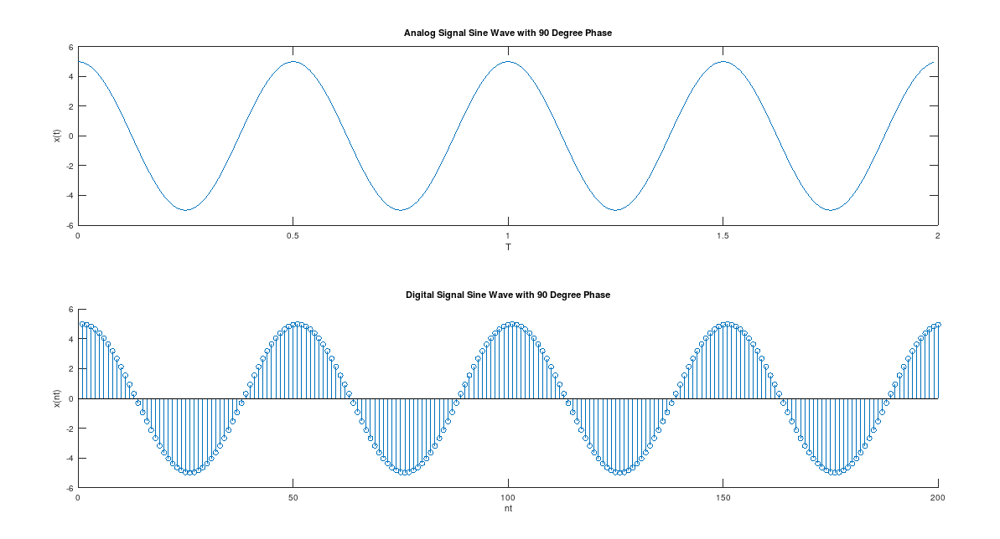
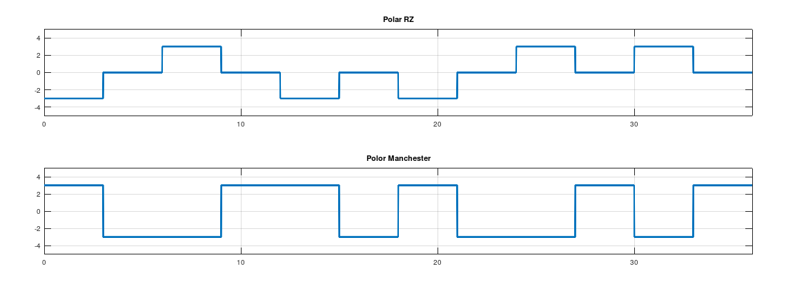
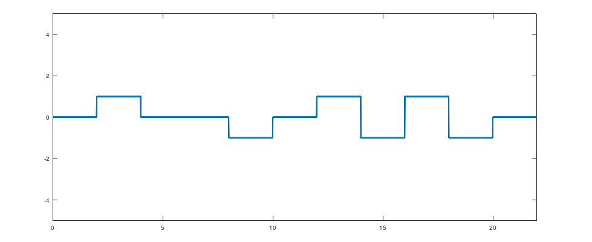
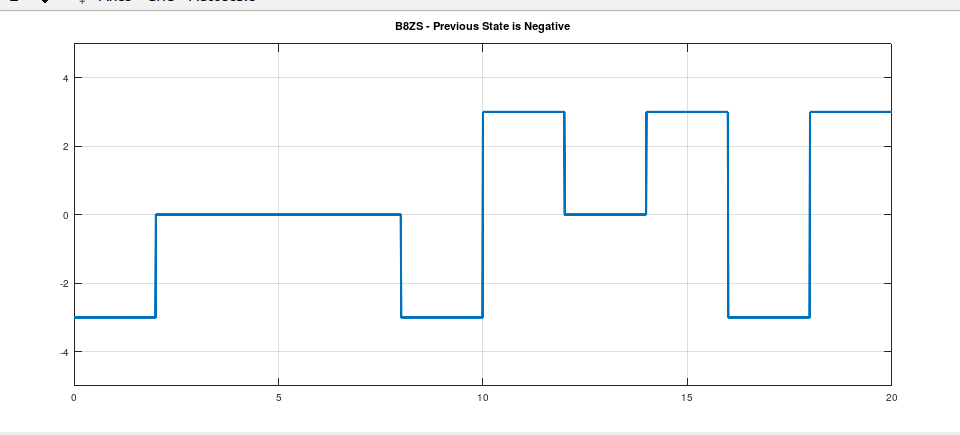

# Communication Lab Final 

**License**:  Make a budget for Kalavuna.

## Table of Contents

### Experiment -1 (Analog and Digital Signal)

```matlab
% _analog signal
% x(t) = 5 sin ( 2 * pi * 2 * t + phase)

clc;
clear all;
close all;

a = 5;
f = 2;
fs = 50 * f;
T = 2;
ph = pi / 2; % 90 degree

t = 0:1/fs:T-(1/fs);

x = a * sin (2 * pi * f * t + ph);

hold on;
subplot(2,1,1);
plot(t, x);
xlabel("T");
ylabel("x(t)");
title("Analog Signal Sine Wave with 90 Degree Phase");


% _digital signal
% x(nt) = 5 sin ( 2 * pi * f/fs * n + phase)
% same as previous, just plot as a stem plot

subplot(2,1,2);
stem(x);
xlabel("nt");
ylabel("x(nt)");
title("Digital Signal Sine Wave with 90 Degree Phase");
```



### Experiment -2 (Composite Analog Signal)

```matlab
% _analog signal
% x(t) = 5 sin ( 2 * pi * 2 * t + phase)

clc;
clear all;
close all;

a = 10;
f = 1;
fs = 50 * f;
T = 2;
ph = 0; % 90 degree

t = 0:1/fs:T-(1/fs);

x1 = a * sin (2 * pi * f * t + ph);
a = 3; f = 3; ph=0;
x2 = a * sin (2 * pi * f * t + ph);
a = 2; f = 5; ph=0;
x3 = a * sin (2 * pi * f * t + ph);

x = x1 + x2 + x3;

hold on;
subplot(4,1,1);
plot(t, x1);
xlabel("T");
ylabel("x1(t)");
title("Analog Signal Sine Wave with 90 Degree Phase");

subplot(4,1,2);
plot(t, x2);
xlabel("T");
ylabel("x2(t)");
title("Analog Signal Sine Wave with 60 Degree Phase");


subplot(4,1,3);
plot(t, x3);
xlabel("T");
ylabel("x3(t)");
title("Analog Signal Sine Wave with 45 Degree Phase");


subplot(4,1,4);
plot(t, x);
xlabel("T");
ylabel("x(t)");
title("Composite Signal");
```


### Experiment - 2 - 1 (Unipolar NRZ Modulation and Demodulation)

```matlab
clear all;
close all;
clc;


bits = [0, 1, 1, 0, 0, 1];
bit_dur = 2;

T = length(bits) * bit_dur;

fs = 100;
t = 0:1/fs:T-(1/fs);

for i = 1:length(bits)
  if bits(i) == 0
    x((i-1)*fs*bit_dur+1:i*fs*bit_dur) = 0
  else
    x((i-1)*fs*bit_dur+1:i*fs*bit_dur) = 5
  endif
endfor


plot(t, x, 'linewidth', 3)
ylim([-5,7])

% demodulation
for i = 1:length(x)/(fs*bit_dur)
  if x(1,(i-1)*fs*bit_dur+1:i*fs*bit_dur) == zeros(1, fs*bit_dur)
    disp(0);
  else
    disp(1);
  endif
endfor

% produce 
```


### Experiment - 2 -2(Bipolar NRZ-L and NRZ-I Modulation and Demodulation)

```matlab
clear all;
close all;
clc;

bits = [0 1 0 0 1 1 1 0];
bit_dur = 2;

fs = 100;
T = length(bits) * bit_dur;

t = 0:1/fs:T-(1/fs);

% NRZ-L
for i = 1:length(bits)
  if bits(i) == 0
    nrzl((i-1)*fs*bit_dur+1:i*fs*bit_dur) = -3;
  else
    nrzl((i-1)*fs*bit_dur+1:i*fs*bit_dur) = 3;
  endif
endfor

subplot(2,1,1);
plot(t,nrzl);
ylim([-5,5]);
xlim([0, T]);
grid on;
title("NRZ-L");
xlabel("Time");
ylabel("Amplitude");

% demodulation NRZ-L
for i = 1:length(nrzl)/(fs*bit_dur)
  if nrzl((i-1)*fs*bit_dur+1:i*fs*bit_dur) == ones(1, (fs*bit_dur)) .* -3
    disp(0);
  else
    disp(1);
  endif
endfor  


% NRZ-I if found 1-> transition
lastbit = 3;
for i = 1:length(bits)
  if bits(i) == 1
    nrzi((i-1)*fs*bit_dur+1:i*fs*bit_dur) = -lastbit;
    lastbit = -lastbit;
  else
    nrzi((i-1)*fs*bit_dur+1:i*fs*bit_dur) = lastbit;
  endif
endfor

subplot(2,1,2);
plot(t,nrzi);
ylim([-5,5]);
grid on;
title("NRZ-I");
xlabel("Time");
xlim([0, T]);
ylabel("Amplitude");

% demodulation NRZ-I

% Hopefully Added Very soon 
```


### Experiment - 2-3(Polar RZ, Manchester, Differential Manchester)

```matlab
clear all;
close all;
clc;

bits = [0 1 0 0 1 1];
bit_dur = length(bits);

fs = 100;
T = length(bits) * bit_dur;

t = 0:1/fs:T-(1/fs);

% Polar RZ Modulation
one = [ones(1, (fs/2)*bit_dur).*3, zeros(1,(fs/2)*bit_dur)];
zero = [ones(1, (fs/2)*bit_dur).*-3, zeros(1,(fs/2)*bit_dur)];

for i = 1:length(bits)
  if bits(i) == 1
    polar_rz((i-1)*fs*bit_dur+1:i*fs*bit_dur) = one;
  else
    polar_rz((i-1)*fs*bit_dur+1:i*fs*bit_dur) = zero;
  endif
endfor


subplot(3,1,1);
plot(t, polar_rz, 'linewidth', 3);
ylim([-5,5]);
xlim([0,T]);
grid on;
title("Polar RZ");

% demodulation Polar RZ
disp("Polar RZ");
for i = 1:length(polar_rz)/(fs*bit_dur)
  if polar_rz((i-1)*fs*bit_dur+1:i*fs*bit_dur) == one
    disp(1);
  else
    disp(0);
  endif
endfor

% modulation of polar manchester 
one = [ones(1, (fs/2)*bit_dur).*-3, ones(1,(fs/2)*bit_dur).*3];
zero = [ones(1, (fs/2)*bit_dur).*3, ones(1,(fs/2)*bit_dur).*-3];

for i = 1:length(bits)
  if bits(i) == 1
    manchester((i-1)*fs*bit_dur+1:i*fs*bit_dur) = one;
  else
    manchester((i-1)*fs*bit_dur+1:i*fs*bit_dur) = zero;
  endif
endfor

subplot(3,1,2);
plot(t, manchester, 'linewidth', 3);
ylim([-5,5]);
xlim([0,T]);
grid on;
title("Polor Manchester");

% demodulation Polar Manchester
disp("Manchester");
for i = 1:length(manchester)/(fs*bit_dur)
  if manchester((i-1)*fs*bit_dur+1:i*fs*bit_dur) == one
    disp(1);
  else
    disp(0);
  endif
endfor


% differential manchester

% added very soon
```



### Experiment - 2-4(Bipolar AMI)

```matlab
clear all;
close all;
clc;

bits = [0 1 0 0 1 0 1 1 1 1 0]; 
bit_dur = 2;
fs = 100;

T = length(bits) * bit_dur;
t = 0:1/fs:T-(1/fs);

% bipolar AMI
last_bit = 1;
for i = 1:length(bits)
  if bits(i) == 0
    x((i-1)*fs*bit_dur+1:i*fs*bit_dur) = zeros(1, (fs*bit_dur));
  else
    x((i-1)*fs*bit_dur+1:i*fs*bit_dur) = ones(1, (fs*bit_dur)).*last_bit;
    last_bit = -last_bit;
  endif
endfor

plot(t, x, 'linewidth', 3);
ylim([-5,5]);
xlim([0,T]);

% demodulation
for i = 1:length(x)/(fs*bit_dur)
  if x((i-1)*fs*bit_dur+1:i*fs*bit_dur) == zeros(1, (bit_dur*fs))
    disp(0);
  else
    disp(1);
  endif
endfor
```



### B8ZS

```matlab
clear all;
close all;
clc;

bits = [1 0 0 0 0 0 0 0 0 1];
bit_dur = 2;
fs = 100;

T = length(bits) * bit_dur;
t = 0:1/fs:T-(1/fs);

counter = 0;
last_bit = 3;

for i = 1:length(bits)
  if bits(i) == 0
    counter = counter + 1
    if counter == 8
      x((i-1-7)*fs*bit_dur+1:(i-7)*fs*bit_dur) = 0;
      x((i-1-6)*fs*bit_dur+1:(i-6)*fs*bit_dur) = 0;
      x((i-1-5)*fs*bit_dur+1:(i-5)*fs*bit_dur) = 0;
      x((i-1-4)*fs*bit_dur+1:(i-4)*fs*bit_dur) = last_bit;
      x((i-1-3)*fs*bit_dur+1:(i-3)*fs*bit_dur) = -last_bit;
      last_bit = -last_bit;
      x((i-1-2)*fs*bit_dur+1:(i-2)*fs*bit_dur) = 0;
      x((i-1-1)*fs*bit_dur+1:(i-1)*fs*bit_dur) = last_bit;
      x((i-1)*fs*bit_dur+1:(i)*fs*bit_dur) = -last_bit;
      last_bit = -last_bit;
      counter = 0
    endif
  else
    counter = 0
    x((i-1)*fs*bit_dur+1:i*fs*bit_dur) = -last_bit;
    last_bit = -last_bit;
  endif
endfor

plot(t, x, 'linewidth', 3);
ylim([-5,5]);
title("B8ZS - Previous State is Negative");
grid on;
```

