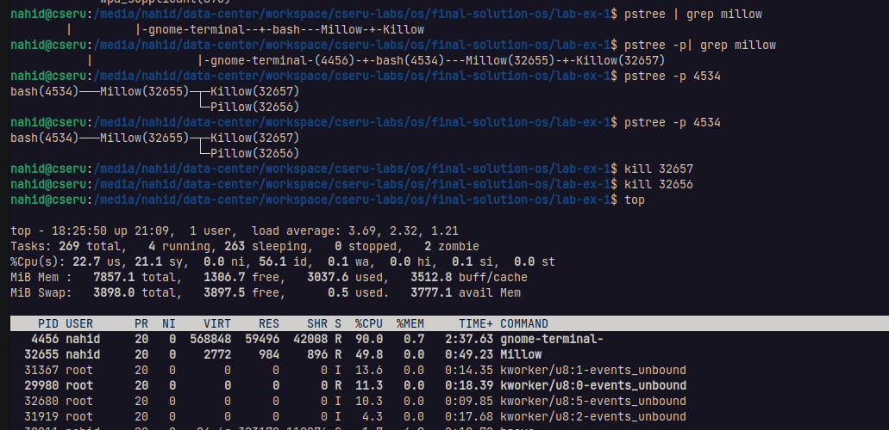

### Experiment - 1

```
Create a process, named Mellow, having two child processes named 'Pillow' and 'Killow'.
All processes show their PIDs & CPU information in an infinite loop.
Mellow shows also its own child processes PIDs. Check two cases:
        a) If Pillow and Killow are killed manually before Mellow.
        b) If Mellow is killed manually before Pillow and Killow.
```

> **Note**: If you don't understand the problem and solution you need to read this <https://github.com/Nahid-Hassan/cseru-labs/blob/main/os/Basics%20Upto%20Pipe.pdf>

All of the code files are in:

- `./Millow.c`
- `./Pillow.c` & 
- `./Killow.c`


**a) If Pillow and Killow are killed manually before Mellow.**

**Answer**: `Two zombie` process is created. Millow running independently. 



**b) If Mellow is killed manually before Pillow and Killow.**

**Answer**: `Pillow` and `Killow` are going to under **systemd**. You cannot close the process using `CTRL-C`. To kill this process you need to kill both Pillow and Killow process individually using `kill -9` command from the terminal.

**Process goes to under systemd**:

```bash
$ pstree 
or
$ pstree -p
```


**Kill the process Pillow and Killow from Terminal**:


